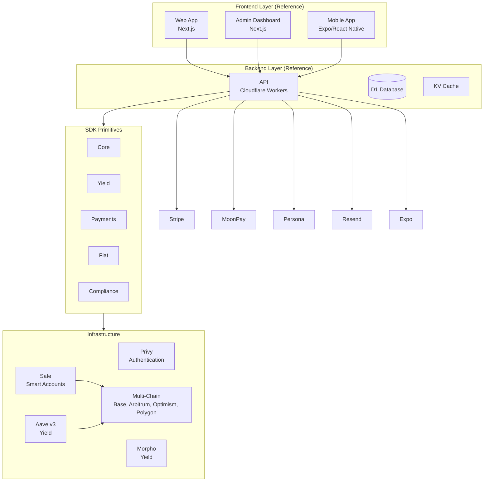
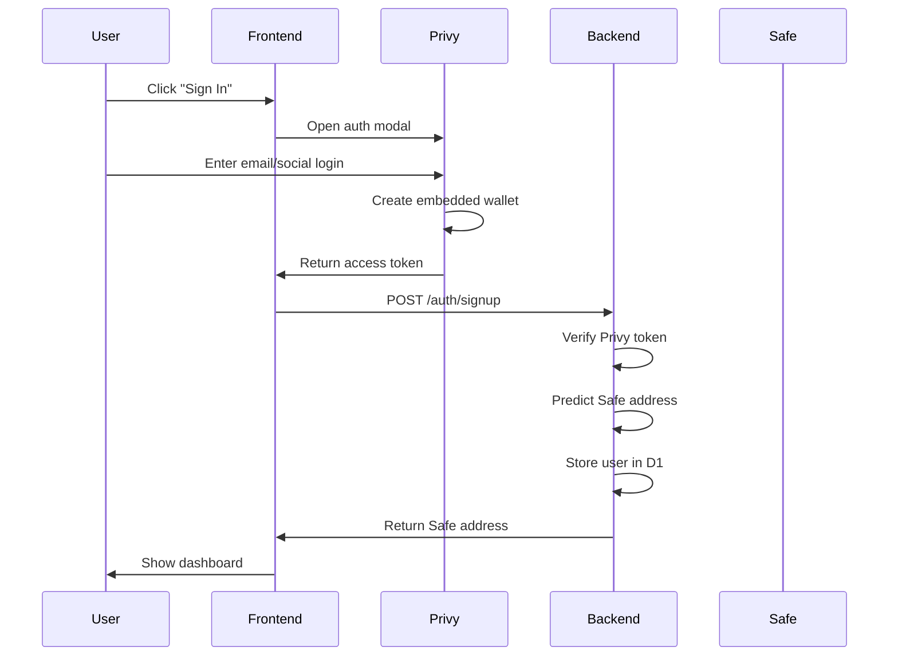
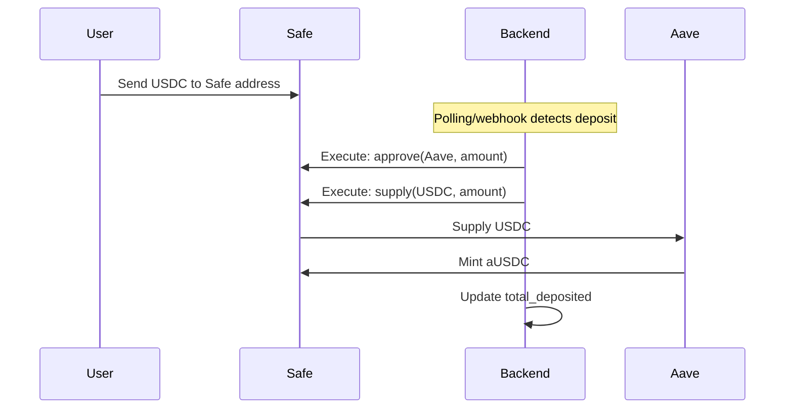
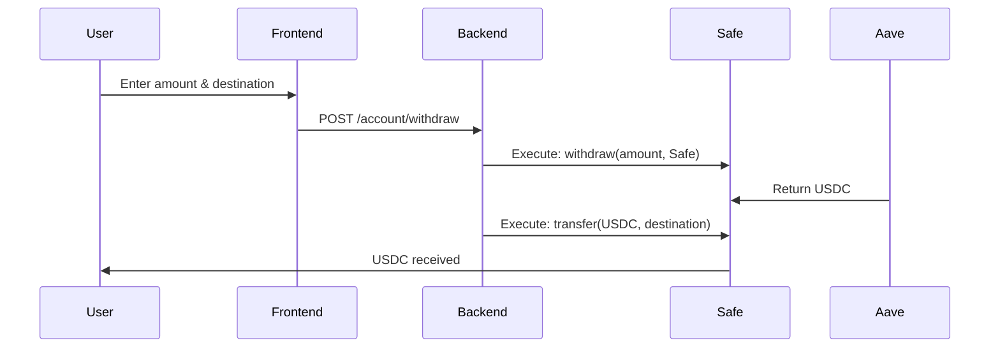

# Stashtab Architecture

This document explains how Stashtab primitives work and how to compose them.

## Overview

Stashtab is a set of composable primitives for building onchain finance products. Each primitive is a self-contained module that solves one specific problem, allowing builders to compose them into whatever they need.

The architecture is designed around composability—use what you need, ignore the rest.

## System Components

### 1. Frontend (Next.js)

The frontend is a Next.js 14 application with the App Router. It handles:

- **Authentication** via Privy (email, Google, Apple login)
- **Dashboard** showing balance, yield earned, APY
- **Deposit** flow with QR code for receiving USDC
- **Send** flow for transferring to other users or external addresses
- **Withdraw** flow for withdrawing to external wallets

Key technologies:

- Next.js 14 (App Router, Server Components)
- Tailwind CSS for styling
- Framer Motion for animations
- Privy React SDK for auth

### 2. Backend (Cloudflare Workers)

The backend is a Cloudflare Workers application using Hono framework. It handles:

- **Authentication** - Verifying Privy tokens, creating user accounts
- **Safe Deployment** - Creating Safe smart accounts for new users
- **Balance Queries** - Reading on-chain balances from Safe and Aave
- **Transaction Execution** - Executing deposits, withdrawals, and transfers

Key technologies:

- Cloudflare Workers (serverless)
- Hono (web framework)
- D1 (SQLite database)
- KV (key-value cache)

### 3. SDK Package

The SDK package (`@stashtab/sdk`) provides reusable functions for:

- **Safe operations** - Deploy, predict address, execute transactions
- **Aave operations** - Supply, withdraw, get balances, get APY
- **Privy utilities** - Token verification helpers

### 4. Config Package

The config package (`@stashtab/config`) provides:

- **Contract addresses** for Base mainnet and Sepolia testnet
- **ABIs** for USDC, Aave Pool, Safe contracts
- **Chain configurations** and RPC URLs
- **Utility functions** for formatting and parsing

## Primitive Architecture

Stashtab primitives follow a consistent structure:

```
packages/sdk/src/
├── core/              # Core infrastructure primitives
│   ├── auth/         # Authentication
│   ├── accounts/     # Account abstraction
│   └── types/        # Shared types
├── yield/            # Yield generation primitives
│   ├── aave/         # Aave v3
│   ├── morpho/       # Morpho Finance
│   └── router/       # Yield routing
├── payments/         # Payment primitives
│   ├── transfers/    # Basic transfers
│   ├── batch/        # Batch payments
│   └── streaming/    # Streaming payments
├── fiat/             # Fiat primitives
│   ├── onramp/       # Fiat to crypto
│   └── offramp/      # Crypto to fiat
└── compliance/       # Compliance primitives
    ├── kyc/          # KYC verification
    ├── sanctions/    # Sanctions screening
    └── reporting/    # Transaction reporting
```

## Composition Patterns

Primitives are designed to be composed. Here are common patterns:

### Neobank Pattern

```typescript
// Compose: accounts + yield + payments + fiat + compliance
const safe = await deploySafe({ owners: [userAddress] });
const publicClient = createStashtabPublicClient(8453);
const aave = createAaveService({ chainId: 8453, publicClient });
const onramp = createOnrampService({ chainId: 8453 });
const kyc = createPersonaService({ apiKey: '...' });
```

### Payroll Pattern

```typescript
// Compose: payments (batch/streaming) + compliance
const batch = createBatchPaymentService({ chainId: 8453 });
const reporting = createComplianceReportingService({ chainId: 8453 });
```

### Treasury Pattern

```typescript
// Compose: yield router + accounts + reporting
const router = createYieldRouter({ chainId: 8453, strategy: 'balanced' });
await router.deposit(usdcAddress, amount, config);
```

## Multi-Chain Architecture

Stashtab supports multiple chains through a chain abstraction layer:

- **Base**: Low fees, Coinbase ecosystem
- **Arbitrum**: High throughput, low latency
- **Optimism**: EVM compatibility
- **Polygon**: Mass market access

Each primitive accepts a `chainId` parameter, and the SDK handles chain-specific configurations automatically.

## Reference Implementation Architecture

The monorepo includes reference implementations showing how to use primitives:



## User Flow

### Sign Up



### Deposit



### Withdraw



## Smart Account Architecture

Each user gets a **Safe smart account** deployed on Base. The Safe is configured with:

- **Single owner**: The user's Privy embedded wallet
- **Threshold**: 1 (single signature required)
- **Fallback handler**: Safe's default fallback handler

### Why Safe?

1. **Security** - Battle-tested, audited by multiple firms
2. **Modularity** - Can add features like spending limits, recovery
3. **Compatibility** - Works with all DeFi protocols
4. **Upgradability** - Can add new modules without migration

### Transaction Execution

All transactions are executed through the Safe:

```typescript
// Example: Supply USDC to Aave
const data = encodeFunctionData({
  abi: AAVE_POOL_ABI,
  functionName: 'supply',
  args: [USDC_ADDRESS, amount, safeAddress, 0],
});

await safe.execTransaction({
  to: AAVE_POOL_ADDRESS,
  value: 0n,
  data,
});
```

## Yield Generation

Stashtab uses **Aave v3** on Base for yield generation:

1. User deposits USDC to their Safe
2. Backend automatically supplies USDC to Aave
3. User receives aUSDC (interest-bearing token)
4. aUSDC balance grows automatically based on supply APY

### APY Calculation

Aave reports liquidity rate in **ray** (27 decimals). To convert to percentage:

```typescript
const RAY = 10n ** 27n;
const apyPercent = Number((liquidityRate * 10000n) / RAY) / 100;
```

### Real-time Earnings

The frontend shows a live earnings ticker by:

1. Fetching current APY from Aave
2. Calculating yield per millisecond
3. Updating display every 50ms with interpolated earnings

## Database Schema

### Users Table

```sql
CREATE TABLE users (
  id TEXT PRIMARY KEY,
  privy_user_id TEXT UNIQUE NOT NULL,
  safe_address TEXT NOT NULL,
  owner_address TEXT NOT NULL,
  total_deposited TEXT DEFAULT '0',
  created_at TEXT NOT NULL,
  updated_at TEXT NOT NULL
);
```

### Transactions Table

```sql
CREATE TABLE transactions (
  id TEXT PRIMARY KEY,
  user_id TEXT NOT NULL,
  type TEXT NOT NULL,
  amount TEXT NOT NULL,
  to_address TEXT,
  from_address TEXT,
  tx_hash TEXT,
  status TEXT DEFAULT 'pending',
  created_at TEXT NOT NULL,
  confirmed_at TEXT,
  FOREIGN KEY (user_id) REFERENCES users(id)
);
```

## Security Model

### Trust Assumptions

1. **Privy** - Trusted for authentication and embedded wallet management
2. **Safe** - Trusted for secure transaction execution
3. **Aave** - Trusted for yield generation and asset custody
4. **Backend** - Has signing authority via Privy server wallet

### Key Risks

See [SECURITY.md](SECURITY.md) for detailed security considerations.

## Future Improvements

### Phase 1 (Current)

- Basic deposit/earn/send/withdraw flow
- Single-chain (Base)
- Single yield source (Aave)

### Phase 2 (Future)

- Multi-chain support
- Multiple yield strategies
- Spending limits and controls
- Recovery mechanisms

### Phase 3 (Community)

- Mobile apps
- Fiat on/off ramps
- Advanced yield optimization
